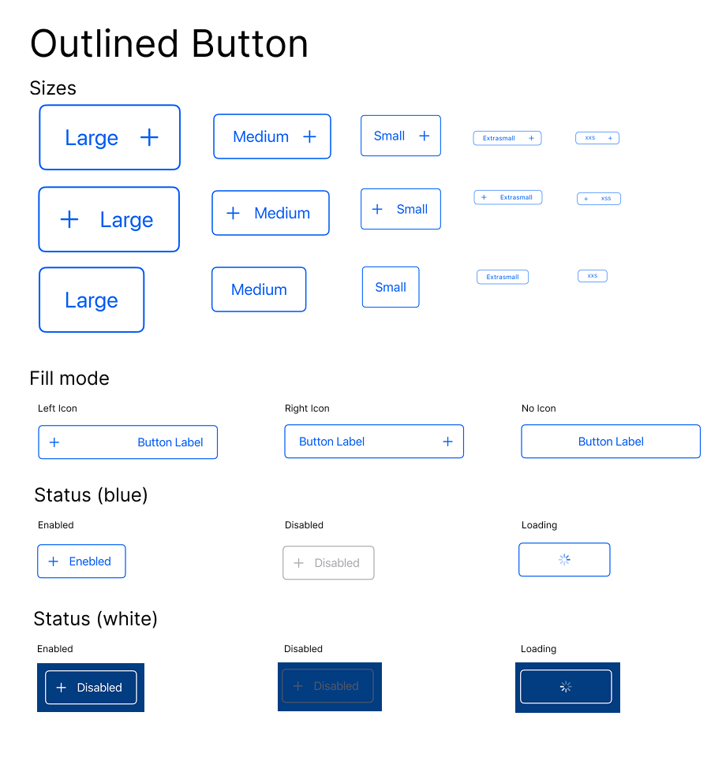

# OutilinedButton


## 📚 Sobre o projeto

Este repositório contém o componente `OutlinedButton` desenvolvido em **SwiftUI**, com o objetivo de praticar e estudar conceitos de **componentização** e **design system**. O botão possui diferentes variações de tamanhos, posicionamento de ícone, cores e estados, sendo um componente reutilizável para futuras aplicações iOS (SwiftUI).

## 🚀 Funcionalidades

- Diferentes tamanhos (large, medium, small, extrasmall, XXS)
- Posicionamente de ícone (leading, trailing, none)
- Suporte a múltiplas cores (blue, white)
- Estados (enabled, diseblad, loading)
- Implementado de forma desacoplada, seguindo boas práticas de componentização

## ⚙️ Instalação e uso

### Pré-requisitos

- Xcode instalado
- Swift 5+
- iOS 15 ou superior

### Como rodar o projeto localmente

1. Clone o repositório:
   ```bash
   git clone https://github.com/seu-usuario/OutlinedButton.git
   ```
2. Abra o projeto no Xcode:
   ```bash
   open OutlinedButton.xcodeproj
   ```
3. Execute no simulador ou em um dispositivo físico.

### Como usar o `OutlinedButton` no seu projeto:

1. Instale o pacote no seu projeto utilizando o link desse repositorio com o Swift Package Maneger do XCode.

2. Faço o import do pacote no arquivo da view que utilizará o Outlined Button.

```
import ComponentsStudyDesignSystem
```

3. Utilize o componente
```swift
OutlinedButton(label: "Botão",
               iconLeading: "plus",
               iconTrailing: nil,
               size: .large,
               color: .blue,
               state: .enabled,
               fillMode: false) 
```

> ⚠️ **Obs**: Personalize os parâmetros conforme a necessidade da sua interface.

## 🤝 Contribuição

Se você deseja contribuir para melhorar a qualidade, organização ou estrutura deste código, sinta-se à vontade para abrir uma issue ou criar um pull request!

### Algumas sugestões de contribuição:
- Refatoração ou melhorias de arquitetura
- Sugestões para melhorar a escalabilidade do design system
- Feedback sobre nomeação, organização e boas práticas em SwiftUI
- Criação de testes unitários ou de snapshot

## 📝 Notas

Este repositório foi criado com foco educacional e experimental.

---

Imagem do botão e suas versões

